# Distributed Observability: Logs, Metrics, Traces, Spans, and Context

Distributed systems are powerful, but they make debugging significantly harder. In a monolithic application, a request might enter a process, execute a few functions, query a database, and return a response. If something goes wrong, looking at the application's logs and stack trace may be enough to understand the problem.

In a distributed system, the same request might look like this:

```mermaid
flowchart LR
    User["User / Client"]
    Gateway["API Gateway"]
    Order["Order Service"]
    Pa
yment["Payment Service"]
    Inventory["Inventory Service"]
    DB["Database"]
    PG["Payment Gateway"]

    User --> Gateway
    Gateway --> Order
    Order --> Payment
    Order --> Inventory
    Payment --> PG
    Payment --> DB
    Inventory --> DB
```

A single user action may therefore cross several processes, machines, queues, databases, and third-party services.

When the request fails or becomes slow, we need to answer questions such as:

- Which service caused the failure?
- Where did the latency come from?
- Which downstream call was slow?
- Which logs belong to this particular request?
- How did a request that started in Service A eventually reach Service F?

This is where **observability** and, in particular, **distributed tracing** become useful.

---

## What is Observability?

Observability lets you understand a system from the outside by asking questions about its behavior without necessarily knowing its internal implementation.

More importantly, good observability helps answer not only **What happened?** but also **Why did it happen?**. To achieve this, applications emit **telemetry**.

> Telemetry is the data produced by a system that describes its behavior.

The observability signals are

| Concept | What it represents | Question it helps answer |
|---|---|---|
| **Log** | A record of an event | What happened? |
| **Metric** | An aggregated measurement over time | How much? How often? |
| **Span** | A timed unit of work | How long did this operation take? |
| **Trace** | A collection of related spans | What happened across the entire request? |
| **Context** | Execution-scoped state used to correlate telemetry | Which request/operation does this telemetry belong to? |
| **Baggage** | Key-value data propagated with context | What additional request information should downstream services know about? |

The interesting part is that these concepts are not isolated **context connects them.**

## Logs

A **log** is a timestamped record of an event emitted by a system component.

```
2026-09-11T10:15:23.452Z INFO Payment request completed order_id=12345 status=success duration_ms=183
```

Logs are excellent for answering understanding **what happened at this particular point in time?** . They can contain information such as:
- error messages
- stack traces
- request parameters
- state changes
- business events
- debugging information
- authentication failures
- database errors

However, logs by themselves have a major limitation in distributed systems. The services may generate hundreds or thousands of log entries per second idintifying which logs belong to a request can only be poossible via a common identifier propagated across.


## Spans

A **span** represents a single unit of work or operation.


Suppose for a `GET` request the application might create a span for the HTTP request and inside that operation, the application might perform several other operations Each of these operations can be represented by its own span.


A span typically contains information such as:
- Span name
- Start timestamp
- End timestamp
- Parent span
- Trace ID
- Span ID


```
Span
├── Trace ID: 4bf92f3577b34da6a3ce929d0e0e4736
├── Span ID: 00f067aa0ba902b7
├── Parent Span ID: 7c3a...
├── Name: GET /orders/:id
├── Start: 10:15:20.100
├── End: 10:15:20.450
├── Status: OK
│
├── Attributes
│   ├── http.request.method = GET
│   ├── http.route = /orders/:id
│   └── http.response.status_code = 200
│
└── Events
    ├── cache.miss
    └── response.sent
<!-- CODE BLOCK END -->
```

Attributes provide structured metadata about the operation.

```
http.request.method = "GET"
http.route = "/orders/:id"
```

> Attributes are particularly useful when querying traces. Instead of searching through arbitrary log strings, an observability backend can answer questions such as
> ```
> Show me all requests to `/orders/:id` that took more than 1 second.
> Show me all database calls where `db.system = postgres`.
> ```


## What is a Trace?

A **trace** represents the end-to-end journey of a request or operation through a distributed system.

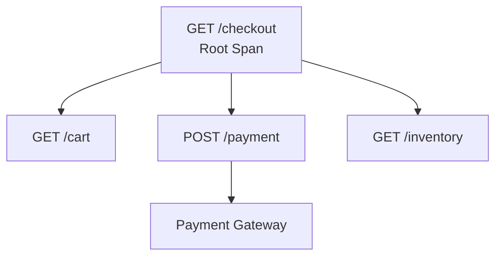

Each individual operation is represented by a span, while the collection of related spans forms the trace. The first span is typically called the **root span**. The root span represents the operation from the perspective of the system's entry point. Child spans provide progressively more detail about what happened during that operation.


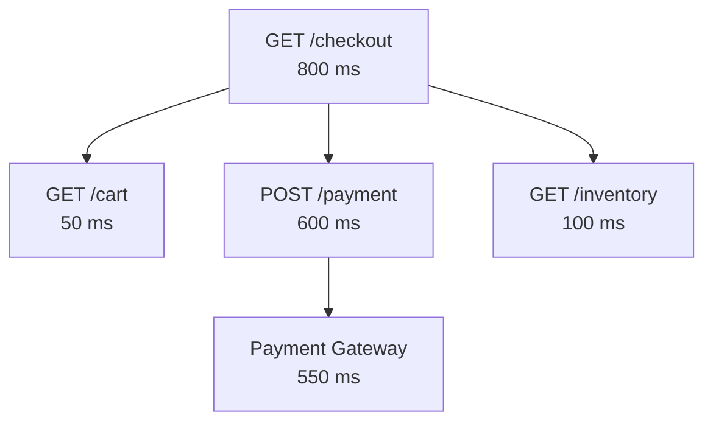

Without tracing, we might have to inspect logs from several different services and manually reconstruct this sequence.

### The Trace Waterfall

Most tracing backends visualize traces as a **waterfall**.


- The horizontal position represents time.
- The width represents duration.
- The nesting in the trace represents parent-child relationships.


This allows to visually identify
- downstream dependencies
- sequential operations
- parallel operations
- retries
- errors
- gaps
- unexpected dependencies


## The Problem: How Does a Trace Cross Service Boundaries?

This is where distributed tracing becomes interesting.

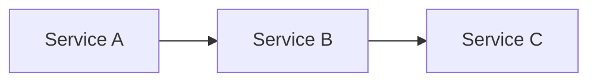

When Service A calls Service B, Service B needs to know that its operation is part of the same trace. This is done by **context propagation**.


### Context

Context is the mechanism used to carry information associated with the current execution across the lifetime of an operation.

For tracing, the important pieces include:
- Trace ID
- Span ID
- Trace Flags
- Trace State


**Context is not the trace itself.** A trace is the complete distributed representation of an operation. Context is the state that allows individual pieces of that operation to know how they relate to the trace.

### Context Propagation

The context has to cross a process and network boundary. **Context propagation** is the mechanism that moves context from one service or process to another.


> OpenTelemetry uses **propagators** to serialize and deserialize this context when it is injected into or extracted from messages.

For HTTP, the most common standard is the **W3C Trace Context** specification.

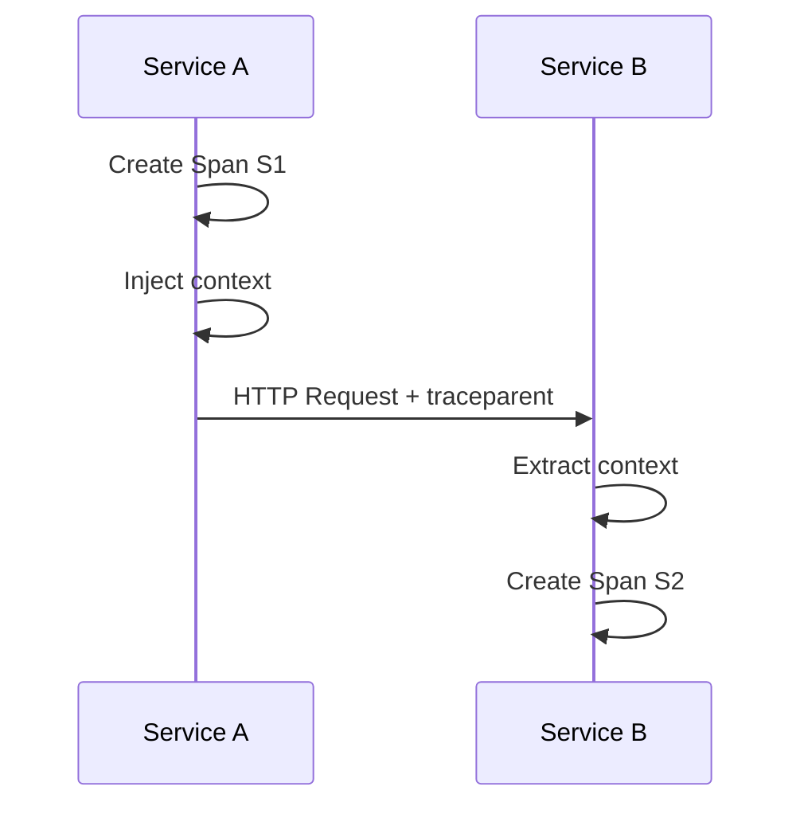

### W3C Trace Context

The W3C Trace Context specification standardizes how distributed tracing information is transmitted between services.

#### `traceparent`

The primary header is `traceparent` with typical value looks like `traceparent: 00-4bf92f3577b34da6a3ce929d0e0e4736-00f067aa0ba902b7-01
`


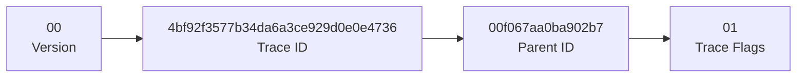

The four fields are:

| Field       | Size         | Meaning                                    |
| ----------- | ------------ | ------------------------------------------ |
| Version     | 2 hex chars  | Version of the Trace Context format        |
| Trace ID    | 32 hex chars | Identifies the distributed trace           |
| Parent ID   | 16 hex chars | Identifies the caller's span               |
| Trace Flags | 2 hex chars  | Flags controlling aspects such as sampling |

So when Service A makes a request to Service B, it extracts the incoming context and creates a new span. The new span gets a **new Span ID**, but keeps the **same Trace ID**.

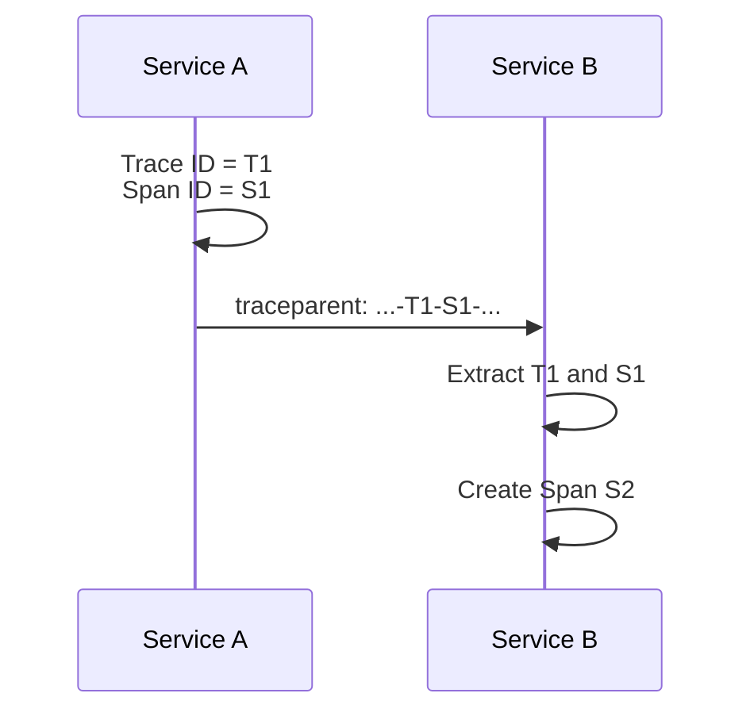

> A Trace ID identifies the entire distributed operation, while a Span ID identifies one particular operation within that trace.

#### `tracestate`

Alongside `traceparent`, W3C Trace Context also defines `tracestate`. While `traceparent` contains the standardized tracing identifiers, `tracestate` carries additional vendor- or implementation-specific tracing information.


```
traceparent: 00-4bf92f3577b34da6a3ce929d0e0e4736-00f067aa0ba902b7-01
tracestate: vendor=value
```

This allows different tracing systems to participate in the same distributed trace while carrying additional information that is meaningful to their implementation.


## Baggage

The trace context answers **which trace and span does this request belong to?** But sometimes we also want to propagate application-specific information. This is where **Baggage** comes in. Baggage is a key-value store that can be propagated across service boundaries alongside trace context.

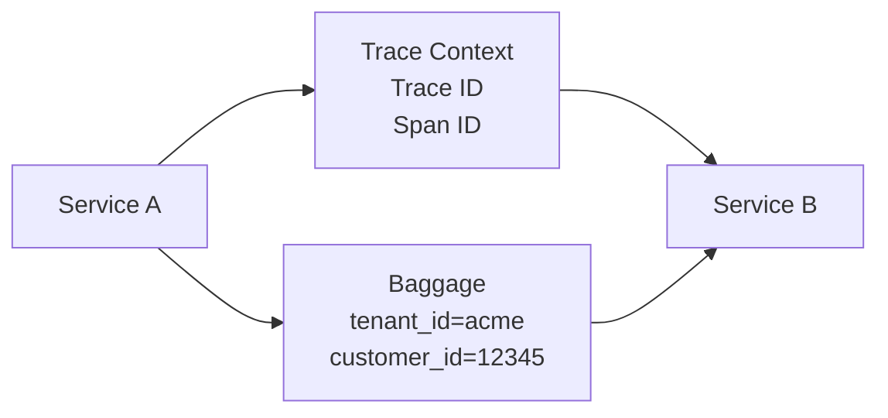

Service B can then use that information when creating telemetry.

> **Baggage is not the same thing as span attributes.** Baggage is propagated state. A span attribute is telemetry attached to a specific span.

## Logs + Traces

Tracing becomes particularly powerful when logs and traces are correlated. On its own, a simple `ERROR` log isn't particularly useful. But if the log contains `trace_id`, `span_id` we can navigate directly from the trace to the exact log generated during the failing operation.

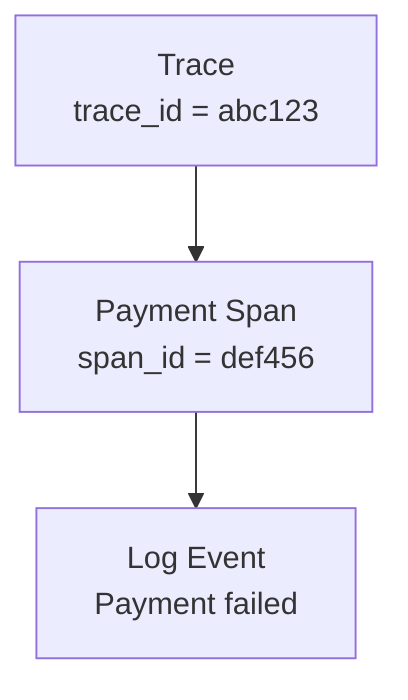

Context propagation makes this correlation possible across service boundaries. This leads to a useful division of responsibilities:

- **Metrics** tell you that something is wrong.
  - HTTP latency p99 increased from 200ms → 2s
- **Traces** tell you where in the request path it went wrong.
  - Most of the latency is inside Payment Service
- **Logs** tell you what happened in detail.
  - Payment Service reports timeout connecting to payment provider
 
Together, these signals give us a much stronger understanding of the system than any individual signal could provide.

## Metrics

A **metric** is a numerical measurement recorded over time, usually aggregated across many events. Metrics are particularly useful for understanding the overall health of a system.


```
Requests/sec       12,500
Error rate            2.4%
p99 latency           1.8s
CPU utilization        78%
```

Metrics are useful for `dashboards`, `alerting`, `capacity planning`, `SLOs`, `trend analysis` but metrics lose detail through aggregation.

Suppose a metric tells `p99 latency = 2.1 seconds` now we know that something is slow. But we don't necessarily know **which request**, **which service**, or **which downstream dependency** caused the latency.


> A useful way to think about 
> - Metric - Is there a problem?
> - Traces - Where is the problem in the request path?
> - Logs - What exactly happened?
> And context provides the connective tissue that allows these signals to be correlated.


## Sampling

Tracing can generate a tremendous amount of data processing all that data can become expensive. This is where **sampling** comes in.

Sampling means selecting which traces or spans should be recorded and/or exported rather than retaining everything. The goal is to reduce telemetry volume while retaining enough information to understand system behavior.

For example, a sampling policy might keep 10% of successful requests or  100% of errors or 100% of slow requests

#### Head-Based Sampling

With **head-based sampling**, the sampling decision is made near the beginning of the trace. 

- The advantage is simplicity and predictable resource usage.
- The disadvantage is that you may decide to discard a trace **before knowing whether it will become interesting**.

#### Tail-Based Sampling

With **tail-based sampling**, the system can wait until more or all of the trace is available before deciding whether to retain it. 

This is particularly useful when you want to drop routine successful requests but retain certain traces with
- Errors
- Slow requests
- Specific customers
- Specific endpoints
- Important business operations


### Why Sampling Must Be Consistent

For distributed tracing to remain useful, sampling decisions need to be coordinated appropriately so that traces remain coherent. If Service A decides to keep the trace but Service B independently decides to drop its span, we could end up with an incomplete trace:

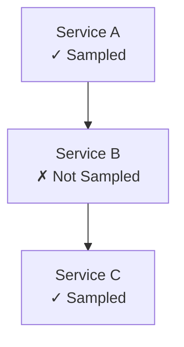

This is one reason the sampling decision can be propagated through the trace context.


### Do We Always Need Sampling?

Sampling may be unnecessary or less important when:
- traffic volume is very low
- traces are small
- storage is inexpensive
- complete trace coverage is required
- the observability system is already aggregating data efficiently

For high-volume production systems, however, sampling can be an important part of controlling observability cost.

> The goal is to **collect enough telemetry to answer the questions we care about at a reasonable cost.**


## A Complete Request Through a Distributed System

Suppose a user places an order `POST /orders`. 

The request enters the API Gateway and the API Gateway becomes the entry point of the trace, so its span is the root span.


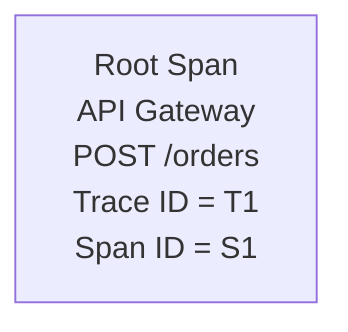

The gateway calls the Order Service and sends something similar to `traceparent: 00-T1-S1-01`and the Order Service extracts this context to create a new span:

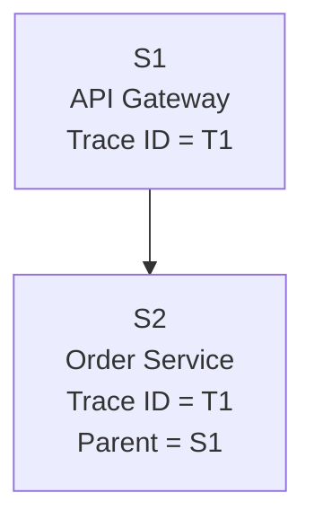

The Trace ID remains `T1`, but the Order Service gets a new Span ID. The parent-child relationship tells us that `S2` was created as part of the operation represented by `S1`.


Suppose now the Order Service calls the Payment Service `traceparent: 00-T1-S2-01` which extracts the incoming context and creates


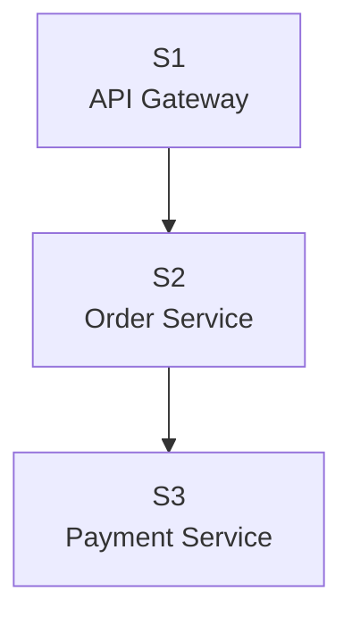

the service then calls Payment Service then calls its database:

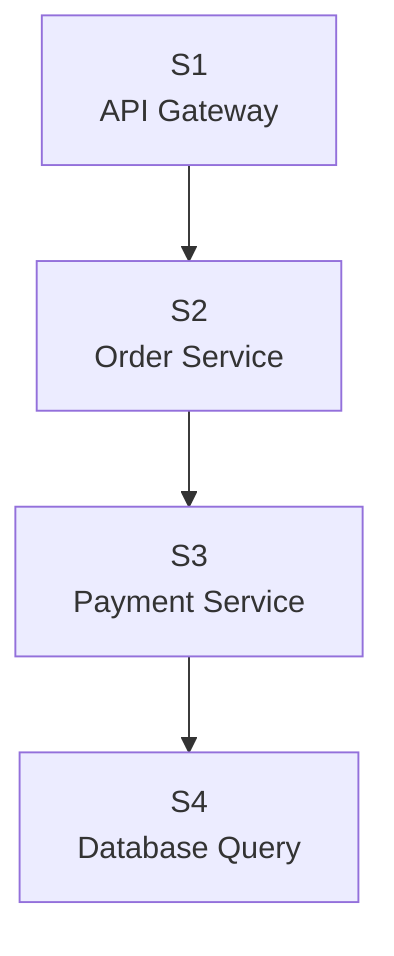

If the database took 900 ms
- the trace tells us **where the time went**
- the logs from the database or payment service can tell us **why**.
- the metrics can tell us whether this is an isolated request or a systemic problem.

```mermaid
gantt
    title POST /orders Trace
    dateFormat X
    axisFormat %L ms

    section API Gateway
    POST /orders : 0, 1100

    section Order Service
    Process order : 30, 1050

    section Payment Service
    Process payment : 50, 1000

    section Database
    Database query : 100, 900
```


> To summarise
> - Metrics tell you that something is wrong.
> - Traces show you where it went wrong.
> - Logs help explain why it went wrong.
> - Context connects the telemetry together.
> - Propagation carries that context across service boundaries.
> - Baggage carries additional application-defined information alongside that context.


## References
- OpenTelemetry Observability Primer  
  https://opentelemetry.io/docs/concepts/observability-primer/
- W3C Trace Context  
  https://www.w3.org/TR/trace-context/
