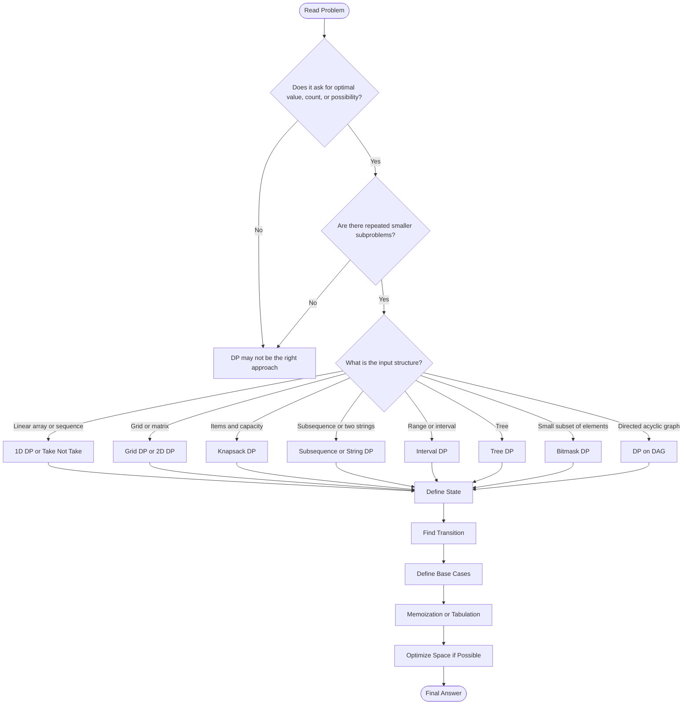

# DP Patterns

```mermaid
flowchart TD
    A([Read Problem]) --> B{Does it ask for optimal value, count, or possibility?}
    B -->|No| Z[DP may not be the right approach]
    B -->|Yes| C{Are there repeated smaller subproblems?}
    C -->|No| Z
    C -->|Yes| D{What is the input structure?}

    D -->|Linear array or sequence| E[1D DP or Take Not Take]
    D -->|Grid or matrix| F[Grid DP or 2D DP]
    D -->|Items and capacity| G[Knapsack DP]
    D -->|Subsequence or two strings| H[Subsequence or String DP]
    D -->|Range or interval| I[Interval DP]
    D -->|Tree| J[Tree DP]
    D -->|Small subset of elements| K[Bitmask DP]
    D -->|Directed acyclic graph| L[DP on DAG]

    E --> M[Define State]
    F --> M
    G --> M
    H --> M
    I --> M
    J --> M
    K --> M
    L --> M

    M --> N[Find Transition]
    N --> O[Define Base Cases]
    O --> P[Memoization or Tabulation]
    P --> Q[Optimize Space if Possible]
    Q --> R([Final Answer])
```